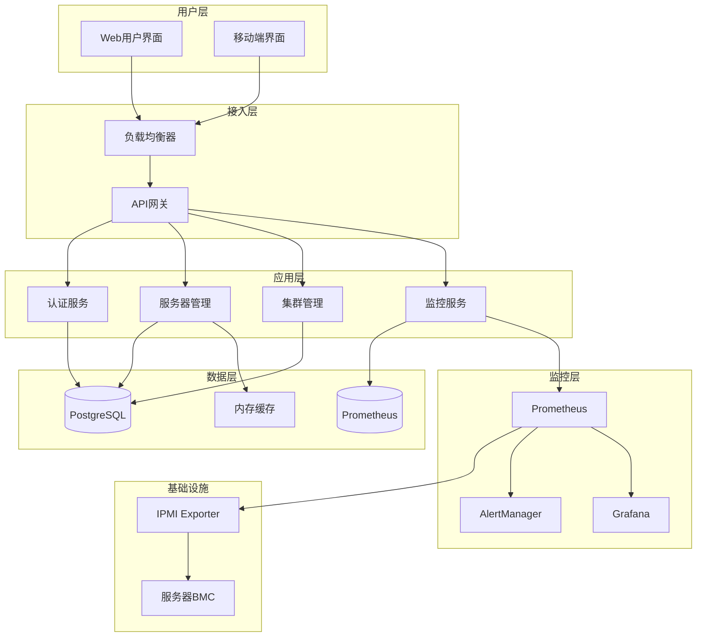
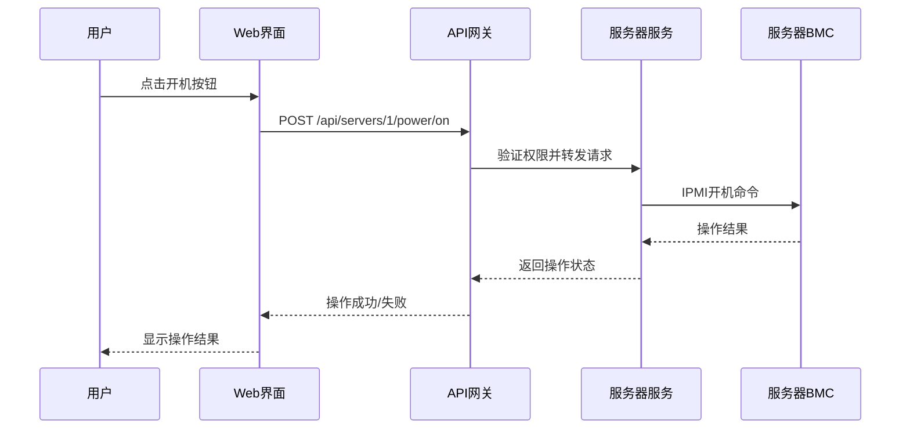
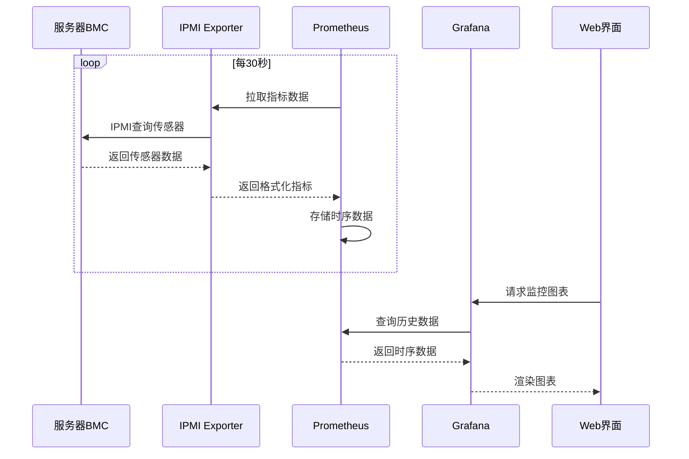
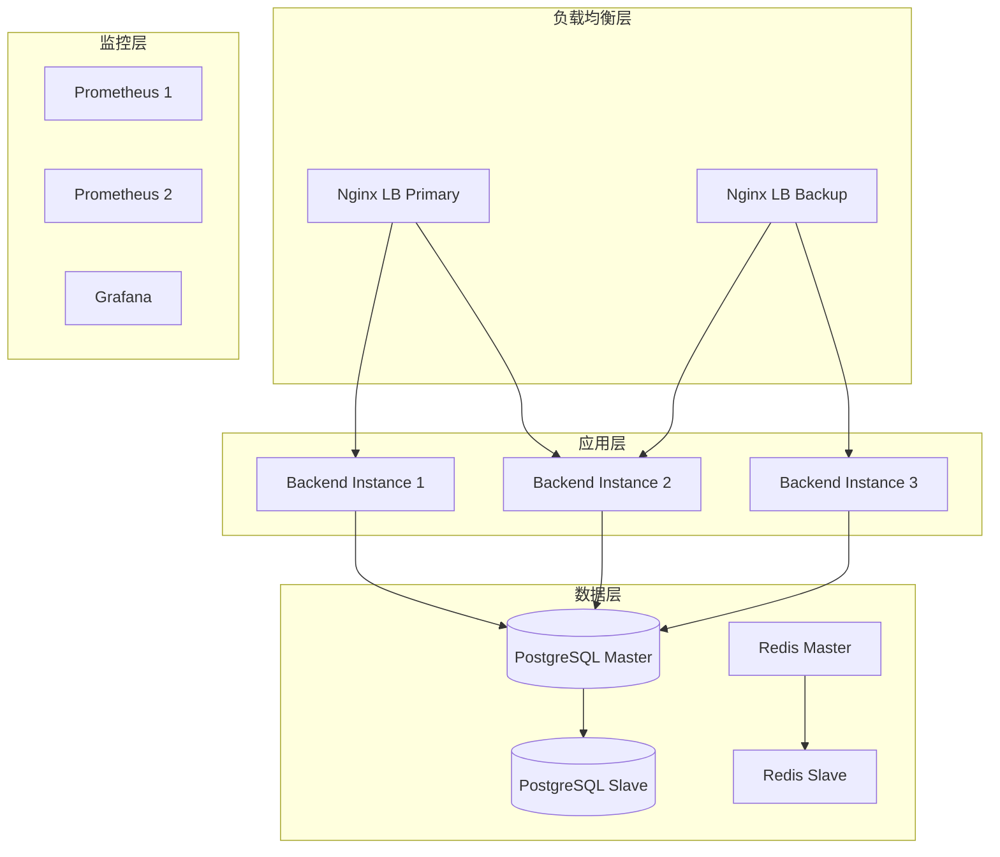
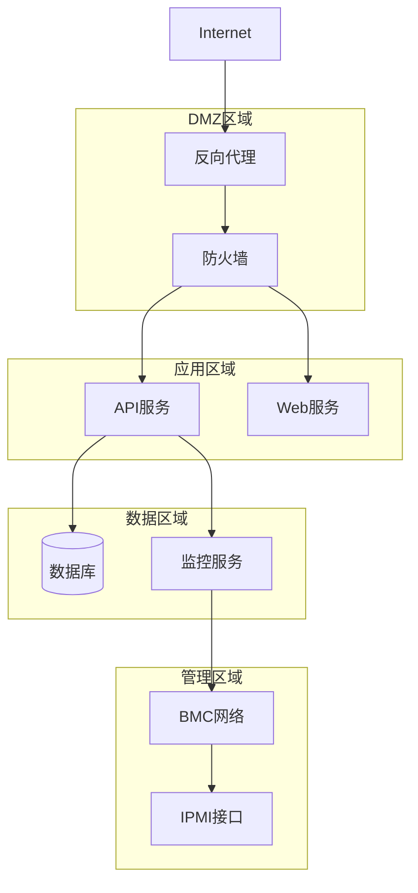
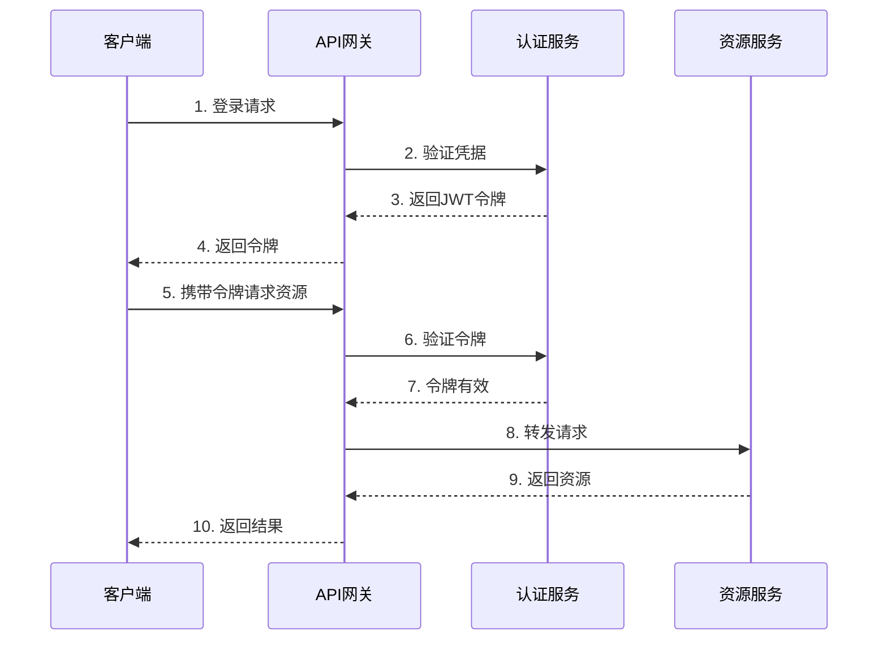
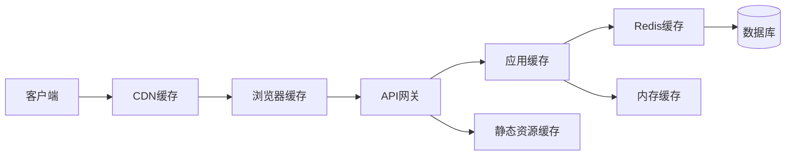

# 系统架构设计

## 整体架构



## 微服务架构设计

### 服务拆分策略

#### 1. 用户认证服务 (Auth Service)
**职责**:
- 用户注册、登录、注销
- JWT令牌管理
- 权限验证
- 会话管理

**接口**:
```
POST /api/auth/login
POST /api/auth/logout
POST /api/auth/refresh
GET  /api/auth/profile
```

#### 2. 服务器管理服务 (Server Management Service)
**职责**:
- 服务器CRUD操作
- BMC连接管理
- 电源控制
- 设备发现

**接口**:
```
GET    /api/servers
POST   /api/servers
PUT    /api/servers/{id}
DELETE /api/servers/{id}
POST   /api/servers/{id}/power/{action}
```

#### 3. 集群管理服务 (Cluster Management Service)
**职责**:
- 服务器分组管理
- 批量操作
- 资源调度

**接口**:
```
GET    /api/clusters
POST   /api/clusters
PUT    /api/clusters/{id}
POST   /api/clusters/{id}/servers
```

#### 4. 监控服务 (Monitoring Service)
**职责**:
- 监控数据查询
- 告警管理
- 仪表板管理

**接口**:
```
GET /api/monitoring/metrics
GET /api/monitoring/alerts
POST /api/monitoring/dashboards
```

## 数据流架构

### 1. 控制流


### 2. 监控数据流


## 部署架构

### 1. 容器化部署
```yaml
# Docker Compose 部署架构
services:
  # 前端服务
  frontend:
    image: openshub/frontend:latest
    ports: ["3000:80"]
    
  # 后端API服务
  backend:
    image: openshub/backend:latest
    ports: ["8080:8080"]
    replicas: 2  # 负载均衡
    
  # 数据库服务
  postgres:
    image: postgres:15
    volumes: ["db_data:/var/lib/postgresql/data"]
    
  # 监控服务栈
  prometheus:
    image: prom/prometheus:latest
    ports: ["9090:9090"]
    
  grafana:
    image: grafana/grafana:latest
    ports: ["3001:3000"]
    
  alertmanager:
    image: prom/alertmanager:latest
    ports: ["9093:9093"]
```

### 2. 高可用部署


## 安全架构

### 1. 网络安全


### 2. 认证授权流程


## 性能架构

### 1. 缓存策略


### 2. 数据库优化
- **读写分离**: 主库写入，从库读取
- **分库分表**: 按服务器集群分片
- **索引优化**: 关键字段建立索引
- **连接池**: 数据库连接复用

### 3. IPMI连接池
```python
# IPMI连接池架构
class IPMIConnectionPool:
    def __init__(self, max_connections=50):
        self.pool = {}
        self.max_connections = max_connections
        
    async def get_connection(self, host, username, password):
        # 连接复用逻辑
        key = f"{host}:{username}"
        if key not in self.pool:
            conn = await self.create_connection(host, username, password)
            self.pool[key] = {
                'connection': conn,
                'last_used': time.time(),
                'use_count': 0
            }
        return self.pool[key]['connection']
```

## 扩展架构

### 1. 水平扩展
- **无状态设计**: 应用服务无状态，支持横向扩展
- **负载均衡**: 支持多实例部署
- **数据库分片**: 支持数据水平分片
- **缓存集群**: Redis集群支持

### 2. 插件架构
```python
# 插件接口定义
class IPMIPlugin:
    def __init__(self, config):
        self.config = config
    
    async def power_control(self, action):
        raise NotImplementedError
    
    async def get_sensors(self):
        raise NotImplementedError

# 厂商特定插件
class DellIPMIPlugin(IPMIPlugin):
    async def power_control(self, action):
        # Dell服务器特定实现
        pass

class HPEIPMIPlugin(IPMIPlugin):
    async def power_control(self, action):
        # HPE服务器特定实现
        pass
```

### 3. API版本管理
```python
# API版本控制
@app.get("/api/v1/servers")
async def get_servers_v1():
    # v1版本实现
    pass

@app.get("/api/v2/servers")
async def get_servers_v2():
    # v2版本实现，向后兼容
    pass
```

## 故障恢复架构

### 1. 健康检查
```yaml
# 健康检查配置
healthcheck:
  test: ["CMD", "curl", "-f", "http://localhost:8080/health"]
  interval: 30s
  timeout: 10s
  retries: 3
  start_period: 40s
```

### 2. 自动恢复
- **服务重启**: 容器异常自动重启
- **故障转移**: 主从切换
- **熔断机制**: 防止级联故障
- **降级策略**: 核心功能保障

### 3. 备份策略
- **数据备份**: 定期数据库备份
- **配置备份**: 系统配置版本控制
- **日志备份**: 操作日志持久化
- **监控数据**: Prometheus数据保留策略