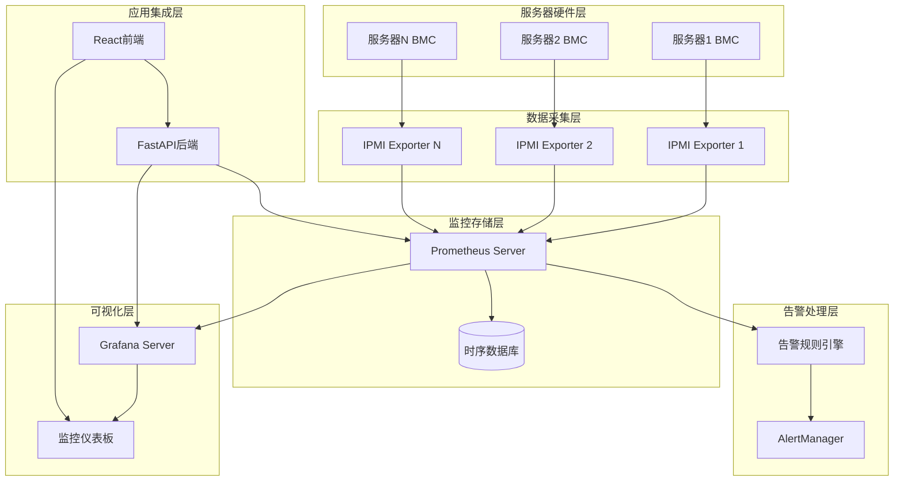
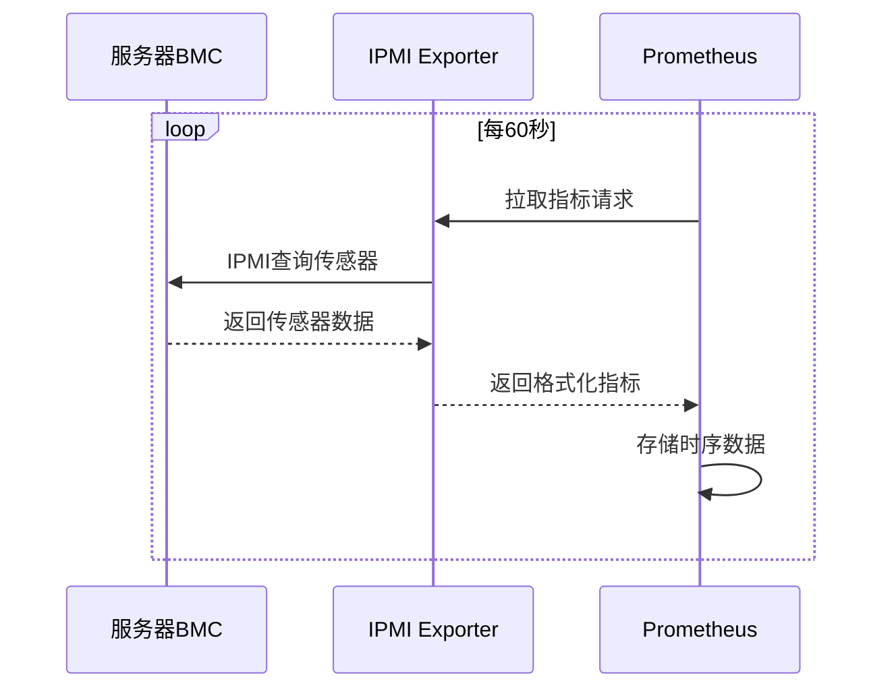
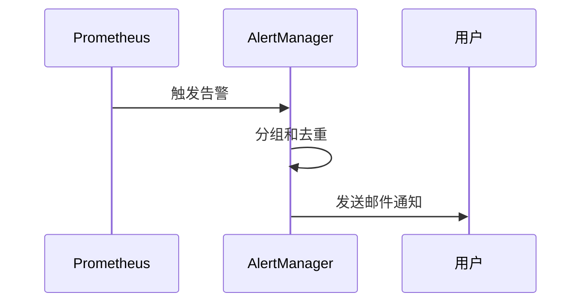

# 监控系统设计

## 监控技术架构

### 整体架构图



## 核心组件设计

### 1. Prometheus配置

#### 主配置文件
```yaml
# monitoring/prometheus/prometheus.yml
global:
  scrape_interval: 30s
  evaluation_interval: 30s
  external_labels:
    cluster: 'openshub-cluster'
    environment: 'production'

alerting:
  alertmanagers:
    - static_configs:
        - targets:
          - alertmanager:9093

rule_files:
  - "rules/*.yml"

scrape_configs:
  # OpenServerHub API监控
  - job_name: 'openshub-api'
    static_configs:
      - targets: ['backend:8080']
    metrics_path: /metrics
    scrape_interval: 15s

  # IPMI服务器监控
  - job_name: 'ipmi-servers'
    static_configs:
      - targets: []  # 动态配置
    scrape_interval: 60s
    scrape_timeout: 30s
    metrics_path: /metrics
```

#### 动态目标配置
```python
# app/services/prometheus_config.py
class PrometheusConfigManager:
    def __init__(self, config_path: str = "/etc/prometheus/prometheus.yml"):
        self.config_path = config_path
        self.reload_url = "http://prometheus:9090/-/reload"
    
    async def add_ipmi_targets(self, servers: List[Dict]) -> bool:
        """动态添加IPMI监控目标"""
        try:
            # 读取当前配置
            async with aiofiles.open(self.config_path, 'r') as f:
                config = yaml.safe_load(await f.read())
            
            # 更新目标列表
            targets = []
            for server in servers:
                if server.get('monitoring_enabled', True):
                    target = f"{server['bmc_ip']}:9290"
                    targets.append(target)
            
            # 更新配置并重载
            await self.reload_prometheus()
            return True
            
        except Exception as e:
            logger.error(f"Failed to update Prometheus config: {e}")
            return False
```

### 2. IPMI Exporter配置

```yaml
# monitoring/ipmi-exporter/ipmi_local.yml
modules:
  default:
    collectors:
    - ipmi
    - dcmi
    exclude_sensor_ids:
    - 2    # 排除特定传感器
    ipmi:
      driver: "LAN_2_0"
      privilege: "user"
      timeout: 10000
      
  dell_servers:
    collectors:
    - ipmi
    - dcmi
    - sel  # 系统事件日志
    ipmi:
      driver: "LAN_2_0" 
      privilege: "user"
      timeout: 15000
```

### 3. 告警规则配置

```yaml
# monitoring/prometheus/rules/hardware_alerts.yml
groups:
  - name: server_hardware
    interval: 30s
    rules:
      # CPU温度告警
      - alert: HighCPUTemperature
        expr: ipmi_temperature_celsius{name=~".*CPU.*"} > 80
        for: 2m
        labels:
          severity: warning
          component: cpu
        annotations:
          summary: "CPU温度过高"
          description: "服务器 {{ $labels.instance }} CPU温度达到 {{ $value }}°C"

      # 风扇故障告警
      - alert: FanFailure
        expr: ipmi_fan_speed_rpm == 0
        for: 30s
        labels:
          severity: critical
          component: fan
        annotations:
          summary: "风扇故障"
          description: "服务器 {{ $labels.instance }} 风扇停止转动"

      # 服务器离线告警
      - alert: ServerDown
        expr: up{job="ipmi-servers"} == 0
        for: 5m
        labels:
          severity: critical
          component: connectivity
        annotations:
          summary: "服务器离线"
          description: "服务器 {{ $labels.instance }} 无法连接"
```

### 4. AlertManager配置

```yaml
# monitoring/alertmanager/alertmanager.yml
global:
  smtp_smarthost: 'smtp.gmail.com:587'
  smtp_from: 'alerts@openshub.com'
  smtp_auth_username: 'alerts@openshub.com'
  smtp_auth_password: 'your-app-password'

route:
  group_by: ['alertname', 'cluster', 'instance']
  group_wait: 10s
  group_interval: 10s
  repeat_interval: 12h
  receiver: 'default'
  routes:
    # 严重告警立即通知
    - match:
        severity: critical
      receiver: 'critical-alerts'
      group_wait: 0s
      repeat_interval: 5m

receivers:
  - name: 'default'
    email_configs:
      - to: 'admin@openshub.com'
        subject: '[OpenServerHub] {{ .Status | toUpper }} - {{ .GroupLabels.alertname }}'
        body: |
          {{ range .Alerts }}
          告警名称: {{ .Annotations.summary }}
          告警详情: {{ .Annotations.description }}
          触发时间: {{ .StartsAt.Format "2006-01-02 15:04:05" }}
          {{ end }}

  - name: 'critical-alerts'
    email_configs:
      - to: 'critical@openshub.com'
        subject: '[CRITICAL] {{ .GroupLabels.alertname }}'
    webhook_configs:
      - url: 'http://backend:8080/api/alerts/webhook'
        send_resolved: true
```

### 5. Grafana集成

#### 仪表板自动创建
```python
# app/services/grafana_service.py
class GrafanaService:
    def __init__(self, grafana_url: str, api_key: str):
        self.grafana_url = grafana_url
        self.grafana = GrafanaFace(auth=api_key, host=grafana_url)
    
    async def create_server_dashboard(self, server: Server) -> dict:
        """为服务器创建专用监控仪表板"""
        dashboard_json = {
            "dashboard": {
                "title": f"服务器监控 - {server.name}",
                "tags": ["server", "hardware", "ipmi"],
                "panels": [
                    self._create_cpu_temperature_panel(server.bmc_ip),
                    self._create_fan_speed_panel(server.bmc_ip),
                    self._create_voltage_panel(server.bmc_ip)
                ]
            }
        }
        
        result = self.grafana.dashboard.create_dashboard(dashboard_json)
        return {
            "success": True,
            "dashboard_uid": result['uid'],
            "dashboard_url": f"{self.grafana_url}/d/{result['uid']}"
        }
```

#### 前端Grafana集成
```tsx
// src/components/monitoring/GrafanaPanel.tsx
const GrafanaPanel: React.FC<GrafanaPanelProps> = ({
  dashboardUid,
  panelId,
  title,
  height = 400
}) => {
  const [embedUrl, setEmbedUrl] = useState<string>('');
  
  useEffect(() => {
    const baseUrl = process.env.REACT_APP_GRAFANA_URL;
    const params = new URLSearchParams({
      orgId: '1',
      refresh: '30s',
      kiosk: 'tv'
    });
    
    if (panelId) {
      setEmbedUrl(`${baseUrl}/d-solo/${dashboardUid}?${params}`);
    } else {
      setEmbedUrl(`${baseUrl}/d/${dashboardUid}?${params}`);
    }
  }, [dashboardUid, panelId]);

  return (
    <Card title={title}>
      <iframe
        src={embedUrl}
        width="100%"
        height={height}
        frameBorder="0"
      />
    </Card>
  );
};
```

## 监控数据流程

### 数据采集流程


### 告警处理流程


## 性能指标

### 关键性能指标
- **数据采集延迟**: <60秒
- **告警响应时间**: <2分钟
- **Grafana面板加载**: <3秒
- **监控数据保留**: 90天
- **告警准确率**: >95%

### 容量规划
- **每台服务器指标数**: ~100个
- **总指标数(200台)**: ~20,000个
- **数据点频率**: 每分钟
- **存储增长**: ~1GB/月