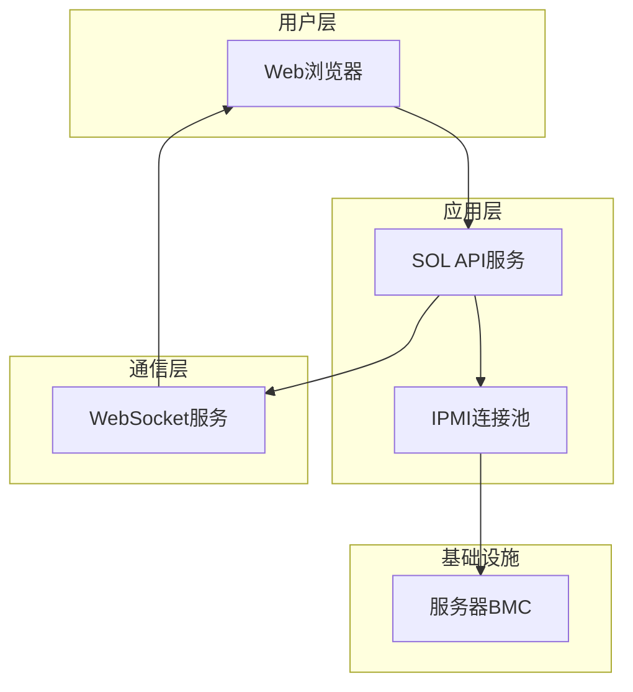

# SOL (Serial Over LAN) 功能设计文档

## 功能概述

SOL (Serial Over LAN) 功能允许用户通过网络远程访问服务器的串口控制台，实现对服务器BIOS设置、系统启动过程和操作系统登录界面的远程查看和控制。该功能将集成到现有的服务器管理界面中，为用户提供更完整的带外管理体验。

## 设计目标

1. **无缝集成**: 在现有服务器管理界面中无缝集成SOL功能
2. **安全访问**: 确保SOL访问的安全性和权限控制
3. **用户体验**: 提供类似本地串口终端的用户体验
4. **资源管理**: 有效管理SOL会话资源，防止资源耗尽
5. **兼容性**: 支持主流服务器厂商的BMC实现

## 技术架构

### 整体架构



### 核心组件

#### 1. SOL API服务
负责处理SOL会话的创建、管理和销毁：
- 激活SOL会话
- 处理终端数据传输
- 管理会话生命周期

#### 2. IPMI连接池
复用现有的IPMI连接池管理机制，为SOL提供专用连接：
- 创建独立的SOL连接
- 管理连接状态
- 处理连接异常

#### 3. WebSocket服务
提供实时双向通信通道：
- 终端数据流传输
- 会话状态通知
- 心跳检测

## 接口设计

### API接口

#### 1. 激活SOL会话
```
POST /api/servers/{server_id}/sol/activate
```

**请求参数**:
- `server_id`: 服务器ID

**响应**:
```json
{
  "status": "success",
  "message": "SOL会话已激活",
  "session_id": "sol_session_12345",
  "websocket_url": "ws://localhost:8000/api/sol/ws/sol_session_12345"
}
```

#### 2. 关闭SOL会话
```
POST /api/servers/{server_id}/sol/deactivate
```

**请求参数**:
- `server_id`: 服务器ID
- `session_id`: 会话ID

**响应**:
```json
{
  "status": "success",
  "message": "SOL会话已关闭"
}
```

### WebSocket协议

#### 连接地址
```
ws://[server]/api/sol/ws/{session_id}
```

#### 消息格式
```json
// 服务器发送到客户端的数据
{
  "type": "data",
  "content": "串口输出内容..."
}

// 客户端发送到服务器的数据
{
  "type": "input",
  "content": "用户输入内容"
}

// 会话状态消息
{
  "type": "status",
  "status": "connected|disconnected|error",
  "message": "状态描述"
}
```

## 数据模型

### SOL会话管理

#### 会话状态
```python
class SOLSessionStatus(Enum):
    PENDING = "pending"      # 等待激活
    ACTIVE = "active"        # 激活状态
    INACTIVE = "inactive"    # 非激活状态
    ERROR = "error"          # 错误状态
    CLOSED = "closed"        # 已关闭
```

#### 会话信息
```python
class SOLSession:
    def __init__(self, session_id: str, server_id: int):
        self.session_id = session_id
        self.server_id = server_id
        self.status = SOLSessionStatus.PENDING
        self.created_at = datetime.now()
        self.last_activity = datetime.now()
        self.pyghmi_console = None  # pyghmi Console对象
        self.websocket_connections = []  # WebSocket连接列表
```

## 安全设计

### 权限控制

1. **访问权限**:
   - 仅系统管理员和运维人员可访问SOL功能
   - 需要单独的SOL访问权限检查

2. **会话隔离**:
   - 每个服务器同时只能有一个活跃的SOL会话
   - 防止多个用户同时操作造成冲突

3. **超时机制**:
   - 会话空闲超时自动断开（默认30分钟）
   - 最大会话时长限制（默认8小时）

### 数据传输安全

1. **传输加密**:
   - WebSocket通信通过TLS加密
   - IPMI连接使用LAN Plus协议加密

2. **敏感信息保护**:
   - 不在日志中记录用户输入内容
   - 会话数据内存中加密存储

## 前端设计

### 终端界面组件

#### 功能特性
1. **终端仿真**:
   - VT100/ANSI终端兼容
   - 支持颜色和特殊字符
   - 支持常用终端快捷键

2. **用户交互**:
   - 键盘输入处理
   - 复制粘贴支持
   - 全屏模式切换
   - 字体大小调整

3. **状态显示**:
   - 连接状态指示
   - 会话时间显示
   - 断线重连提示

### 界面集成

#### 服务器操作菜单
在现有服务器管理界面的操作菜单中添加"串口访问(SOL)"选项：
- 位置：服务器操作下拉菜单
- 图标：终端图标
- 权限：仅对有权限用户显示

#### SOL访问页面
独立的SOL访问页面包含：
- 终端显示区域
- 连接状态栏
- 操作按钮（断开、全屏、设置等）
- 会话信息显示

## 后端实现

### pyghmi集成

#### Console对象使用
```python
from pyghmi.ipmi.console import Console

# 创建SOL连接
console = Console(
    bmc=server_ip,
    userid=username,
    password=password,
    port=server_port,
    force=True  # 强制连接
)

# 发送数据
console.send_data("ls -l\n")

# 关闭连接
console.close()
```

#### 数据处理
1. **输入处理**:
   - 将用户键盘输入转发到BMC
   - 处理特殊键（Ctrl+C, Ctrl+Z等）

2. **输出处理**:
   - 实时接收BMC串口输出
   - 格式化后通过WebSocket发送到前端

### 会话管理

#### 会话生命周期
1. **创建**:
   - 用户请求激活SOL会话
   - 验证权限和服务器状态
   - 创建pyghmi Console对象
   - 建立WebSocket连接

2. **运行**:
   - 双向数据传输
   - 心跳检测
   - 活动时间更新

3. **销毁**:
   - 用户主动断开
   - 超时自动断开
   - 服务器异常断开
   - 清理会话资源

#### 资源限制
1. **并发限制**:
   - 系统级最大SOL会话数限制（默认10个）
   - 每服务器最多1个活跃会话

2. **内存管理**:
   - 会话数据缓存限制
   - 定期清理过期会话

## 部署考虑

### 环境要求

1. **网络配置**:
   - 确保WebSocket端口可达
   - BMC网络连通性检查
   - 防火墙规则配置

2. **性能要求**:
   - 足够的内存处理并发会话
   - 网络带宽支持终端数据流
   - CPU资源处理数据转发

### 监控和日志

1. **会话监控**:
   - 活跃会话数统计
   - 会话时长记录
   - 错误率监控

2. **日志记录**:
   - 会话创建/销毁日志
   - 连接错误日志
   - 性能指标日志

## 错误处理

### 常见错误场景

1. **连接失败**:
   - BMC不可达
   - 认证失败
   - 权限不足

2. **会话异常**:
   - 网络中断
   - BMC重启
   - 资源不足

3. **数据传输错误**:
   - 数据包丢失
   - 格式错误
   - 缓冲区溢出

### 处理策略

1. **重试机制**:
   - 网络瞬时故障自动重连
   - 重试次数限制

2. **降级处理**:
   - 连接失败时返回明确错误信息
   - 资源不足时拒绝新会话

3. **用户提示**:
   - 清晰的错误信息显示
   - 操作建议提供

## 测试计划

### 功能测试

1. **会话管理测试**:
   - SOL会话创建和销毁
   - 权限控制验证
   - 并发会话限制

2. **数据传输测试**:
   - 输入输出功能验证
   - 特殊字符处理
   - 大数据量传输

3. **异常处理测试**:
   - 网络中断恢复
   - BMC异常处理
   - 超时机制验证

### 性能测试

1. **并发测试**:
   - 多用户同时访问
   - 会话资源占用
   - 响应时间测试

2. **稳定性测试**:
   - 长时间会话保持
   - 内存泄漏检测
   - 系统资源监控

## 未来扩展

### 功能增强

1. **录制回放**:
   - 会话录制功能
   - 操作回放支持
   - 审计日志生成

2. **多终端支持**:
   - 多个串口访问
   - 不同波特率支持
   - 自定义终端参数

3. **集成扩展**:
   - 与其他管理工具集成
   - 脚本自动化支持
   - API扩展接口

### 技术优化

1. **协议升级**:
   - 支持Redfish协议
   - KVM over IP集成
   - 虚拟媒体支持

2. **性能优化**:
   - 数据压缩传输
   - 智能缓冲管理
   - 异步处理优化