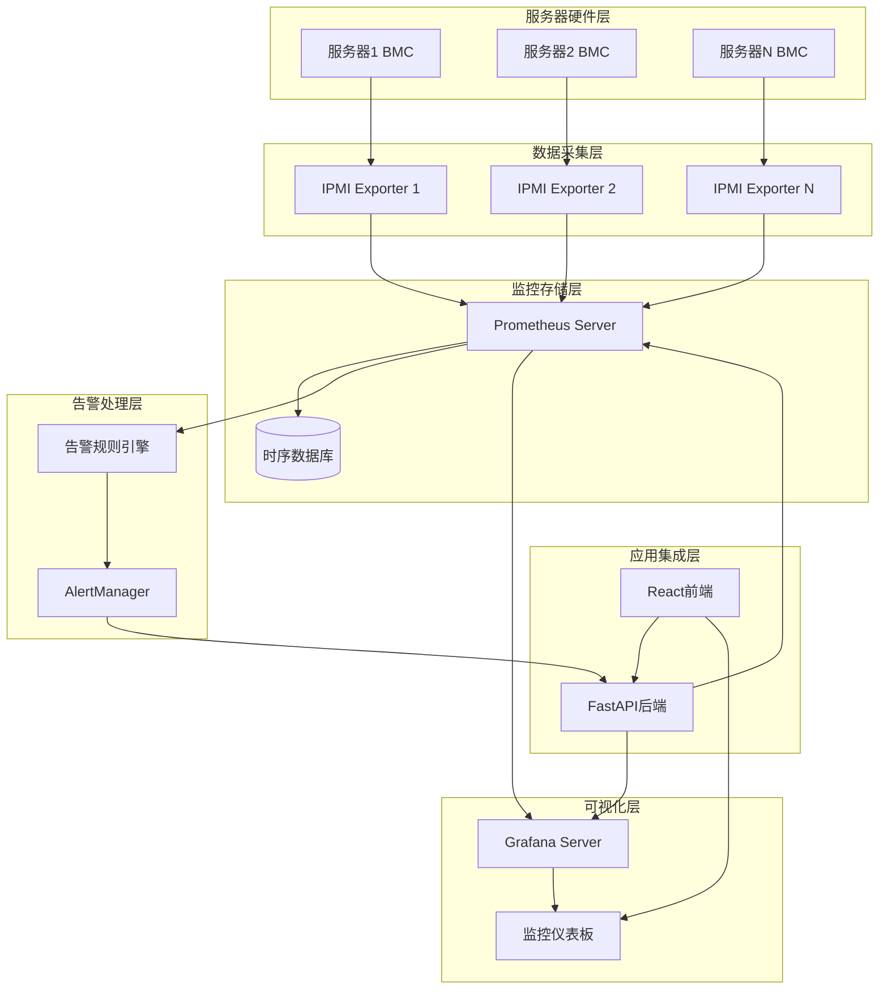
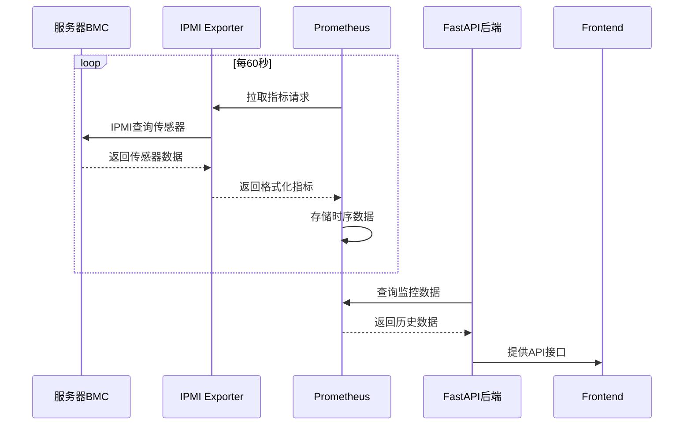
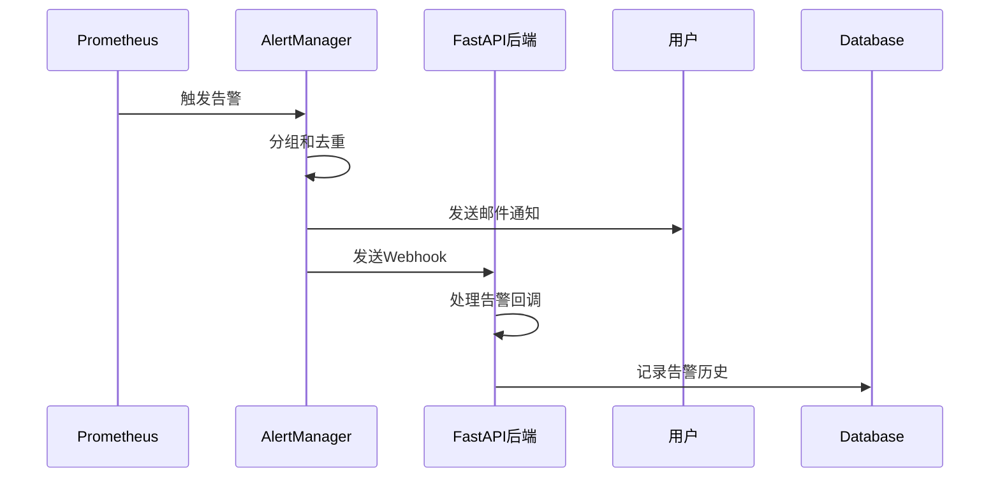

# 监控系统架构设计

## 1. 概述

本文档详细描述 OpenServerHub 监控系统的整体架构设计，包括组件职责、数据流向和集成方式。

## 2. 设计目标

1. 集成 Prometheus 时序数据库进行监控数据存储
2. 使用 IPMI Exporter 独立容器进行硬件数据采集
3. 实现监控目标的动态管理（添加/删除服务器时自动更新）
4. 集成 AlertManager 告警系统
5. 实现 Grafana 可视化集成
6. 提供完整的监控数据查询和展示 API

## 3. 系统架构

### 3.1 整体架构图

### 3.2 组件职责说明

| 组件 | 职责 |
|------|------|
| IPMI Exporter | 独立容器运行，通过 IPMI 协议从 BMC 采集硬件传感器数据 |
| Prometheus | 时序数据库，定期从 IPMI Exporter 拉取监控指标并存储 |
| AlertManager | 处理 Prometheus 发送的告警，支持邮件、Webhook 等通知方式 |
| Grafana | 监控数据可视化展示，提供丰富的仪表板和图表 |
| FastAPI 后端 | 提供监控数据查询 API，管理监控配置，处理告警回调 |
| React 前端 | 展示监控数据和仪表板，提供用户交互界面 |

## 4. 数据流向

### 4.1 监控数据采集流程

### 4.2 告警处理流程

## 5. 部署架构

### 5.1 容器化部署

所有监控组件均采用容器化部署，通过 Docker Compose 进行统一编排管理。

### 5.2 网络架构

组件间通过内部网络进行通信，对外暴露必要的端口：
- Prometheus: 9090
- AlertManager: 9093
- Grafana: 3001

## 6. 安全设计

### 6.1 认证与授权
1. Prometheus API 访问需要认证
2. Grafana 集成使用 API Key
3. IPMI Exporter 使用独立的认证配置

### 6.2 网络安全
1. 限制 Prometheus 和 AlertManager 的网络访问
2. 使用 HTTPS 加密通信
3. IPMI Exporter 仅暴露必要的端口

### 6.3 数据保护
1. 敏感信息（如 IPMI 密码）加密存储
2. 监控数据备份策略
3. 访问日志记录和审计