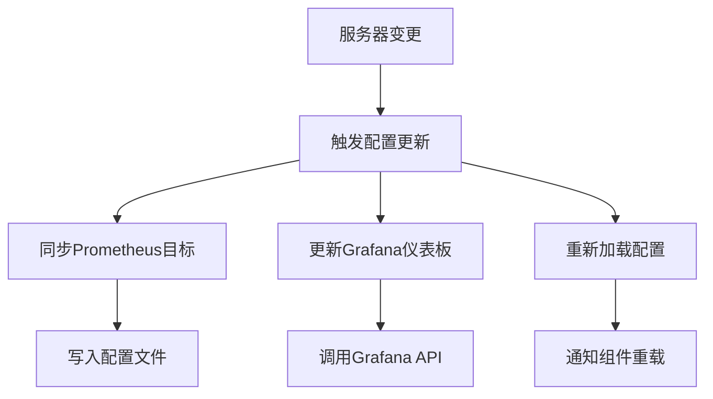

# 监控系统配置管理

## 1. 概述

本文档详细描述 OpenServerHub 监控系统的配置管理机制，包括动态配置更新、服务器变更处理和配置同步机制。

## 2. 配置管理架构

### 2.1 配置组件
1. **Prometheus 目标配置**: 管理监控目标列表
2. **IPMI Exporter 配置**: 管理 IPMI 采集参数
3. **Grafana 仪表板配置**: 管理可视化面板
4. **告警规则配置**: 管理告警触发条件

### 2.2 配置更新流程


## 3. 服务器添加/删除时的配置同步

### 3.1 服务器添加处理
当服务器被添加时，系统需要执行以下操作：

```python
# app/services/server_monitoring.py
async def on_server_added(self, server: Server) -> bool:
    """服务器添加时的监控配置处理"""
    try:
        # 1. 如果启用了监控，创建openshub用户
        if server.monitoring_enabled:
            await self.ipmi_service.ensure_openshub_user(
                server.ipmi_ip,
                server.ipmi_username,
                server.ipmi_password,
                server.ipmi_port
            )
        
        # 2. 同步Prometheus目标配置（仅包含启用监控的服务器）
        servers = self.db.query(Server).filter(Server.monitoring_enabled == True).all()
        await self.prometheus_manager.sync_ipmi_targets(servers)
        
        # 3. 为新服务器创建Grafana仪表板
        if server.monitoring_enabled:
            await self.grafana_service.create_server_dashboard(server)
        
        logger.info(f"服务器 {server.id} 监控配置已更新")
        return True
    except Exception as e:
        logger.error(f"服务器 {server.id} 监控配置更新失败: {e}")
        return False
```

### 3.2 服务器删除处理
当服务器被删除时，系统需要执行以下操作：

```python
async def on_server_deleted(self, server_id: int) -> bool:
    """服务器删除时的监控配置处理"""
    try:
        # 1. 同步Prometheus目标配置（排除已删除的服务器）
        servers = self.db.query(Server).filter(
            Server.monitoring_enabled == True,
            Server.id != server_id
        ).all()
        await self.prometheus_manager.sync_ipmi_targets(servers)
        
        # 2. 可以选择删除对应的Grafana仪表板
        
        logger.info(f"服务器 {server_id} 监控配置已清理")
        return True
    except Exception as e:
        logger.error(f"服务器 {server_id} 监控配置清理失败: {e}")
        return False
```

### 3.3 服务器更新处理
当服务器信息被更新时，系统需要执行以下操作：

```python
async def on_server_updated(self, server: Server, original_monitoring_enabled: bool) -> bool:
    """服务器更新时的监控配置处理"""
    try:
        # 如果监控状态从禁用变为启用
        if not original_monitoring_enabled and server.monitoring_enabled:
            # 创建openshub用户
            await self.ipmi_service.ensure_openshub_user(
                server.ipmi_ip,
                server.ipmi_username,
                server.ipmi_password,
                server.ipmi_port
            )
            
            # 创建Grafana仪表板
            await self.grafana_service.create_server_dashboard(server)
        
        # 如果监控状态发生变化，则同步配置
        servers = self.db.query(Server).filter(Server.monitoring_enabled == True).all()
        await self.prometheus_manager.sync_ipmi_targets(servers)
        
        logger.info(f"服务器 {server.id} 监控配置已同步")
        return True
    except Exception as e:
        logger.error(f"服务器 {server.id} 监控配置同步失败: {e}")
        return False
```

## 4. Prometheus 动态配置管理

### 4.1 配置管理器实现
```python
# app/services/prometheus_config.py
class PrometheusConfigManager:
    """Prometheus配置管理器"""
    
    def __init__(self, config_path: str = "/etc/prometheus/targets/ipmi-targets.json"):
        self.config_path = config_path
        self.reload_url = f"{settings.PROMETHEUS_URL}/-/reload"
    
    async def sync_ipmi_targets(self, servers: List[Server]) -> bool:
        """根据服务器列表同步IPMI监控目标"""
        try:
            # 生成目标配置
            targets = []
            for server in servers:
                target = {
                    "targets": ["ipmi-exporter:9290"],
                    "labels": {
                        "server_id": str(server.id),
                        "server_name": server.name,
                        "module": "remote",
                        "ipmi_ip": server.ipmi_ip,
                        "manufacturer": server.manufacturer or "unknown",
                        "__param_target": server.ipmi_ip,
                        "__param_username": "openshub",
                        "__param_password": "openshub",
                        "__param_port": str(server.ipmi_port),
                        "__param_privilege": "USER"
                    }
                }
                targets.append(target)
            
            # 写入配置文件
            config_data = targets
            async with aiofiles.open(self.config_path, 'w') as f:
                await f.write(json.dumps(config_data, indent=2))
            
            # 通知Prometheus重新加载配置
            await self.reload_prometheus()
            return True
            
        except Exception as e:
            logger.error(f"Failed to sync Prometheus config: {e}")
            return False
    
    async def reload_prometheus(self) -> bool:
        """通知Prometheus重新加载配置"""
        try:
            async with httpx.AsyncClient() as client:
                response = await client.post(self.reload_url)
                if response.status_code == 200:
                    logger.info("Prometheus config reloaded successfully")
                    return True
                else:
                    logger.error(f"Failed to reload Prometheus config: {response.status_code}")
                    return False
        except Exception as e:
            logger.error(f"Failed to reload Prometheus: {e}")
            return False
```

### 4.2 配置文件格式
```json
[
  {
    "targets": ["ipmi-exporter:9290"],
    "labels": {
      "server_id": "1",
      "server_name": "server-01",
      "module": "remote",
      "ipmi_ip": "192.168.1.100",
      "manufacturer": "Dell",
      "__param_target": "192.168.1.100",
      "__param_username": "openshub",
      "__param_password": "openshub",
      "__param_port": "623",
      "__param_privilege": "USER"
    }
  }
]
```

## 5. Grafana 仪表板管理

### 5.1 仪表板自动创建
```python
# app/services/grafana_service.py
class GrafanaService:
    """Grafana服务"""
    
    def __init__(self, grafana_url: str = None, api_key: str = None):
        self.grafana_url = grafana_url or settings.GRAFANA_URL
        self.headers = {
            "Authorization": f"Bearer {api_key or settings.GRAFANA_API_KEY}",
            "Content-Type": "application/json"
        }
    
    async def create_server_dashboard(self, server: Server) -> dict:
        """为服务器创建专用监控仪表板"""
        dashboard_json = {
            "dashboard": {
                "title": f"服务器监控 - {server.name}",
                "tags": ["server", "hardware", "ipmi", f"server-{server.id}"],
                "panels": [
                    self._create_cpu_temperature_panel(server.id),
                    self._create_fan_speed_panel(server.id),
                    self._create_voltage_panel(server.id),
                ]
            },
            "overwrite": True
        }
        
        try:
            async with httpx.AsyncClient() as client:
                response = await client.post(
                    f"{self.grafana_url}/api/dashboards/db",
                    headers=self.headers,
                    json=dashboard_json
                )
                
                if response.status_code == 200:
                    result = response.json()
                    logger.info(f"Dashboard created for server {server.id}")
                    return {
                        "success": True,
                        "dashboard_uid": result['uid'],
                        "dashboard_url": f"{self.grafana_url}/d/{result['uid']}"
                    }
                else:
                    logger.error(f"Grafana API error: {response.status_code}")
                    return {
                        "success": False,
                        "error": f"Grafana API error: {response.status_code}"
                    }
        except Exception as e:
            logger.error(f"Failed to create Grafana dashboard: {e}")
            return {
                "success": False,
                "error": str(e)
            }
```

### 5.2 仪表板面板设计
```python
def _create_cpu_temperature_panel(self, server_id: int):
    """创建CPU温度面板"""
    return {
        "title": "CPU温度",
        "type": "timeseries",
        "datasource": "Prometheus",
        "targets": [
            {
                "expr": f'ipmi_temperature_celsius{{server_id="{server_id}",name=~".*CPU.*"}}',
                "legendFormat": "{{name}}",
                "refId": "A"
            }
        ],
        "fieldConfig": {
            "defaults": {
                "unit": "celsius",
                "min": 0,
                "max": 100
            }
        }
    }
```

## 6. 配置同步机制

### 6.1 配置变更监听
系统通过监听服务器管理服务中的事件来触发配置更新：

```python
# app/services/server.py
class ServerService:
    def __init__(self, db: Session):
        self.db = db
        self.monitoring_service = ServerMonitoringService(db)
    
    async def create_server(self, server_create: ServerCreate) -> Server:
        """创建服务器并同步监控配置"""
        server = Server(**server_create.dict())
        self.db.add(server)
        self.db.commit()
        self.db.refresh(server)
        
        # 同步监控配置
        await self.monitoring_service.on_server_added(server)
        
        return server
    
    async def delete_server(self, server_id: int) -> bool:
        """删除服务器并同步监控配置"""
        server = self.db.query(Server).filter(Server.id == server_id).first()
        if not server:
            return False
            
        self.db.delete(server)
        self.db.commit()
        
        # 同步监控配置
        await self.monitoring_service.on_server_deleted(server_id)
        
        return True
```

### 6.2 配置重载机制
各组件支持通过 HTTP API 或信号进行配置重载：

```python
# Prometheus 重载
async def reload_prometheus(self) -> bool:
    """通知Prometheus重新加载配置"""
    try:
        async with httpx.AsyncClient() as client:
            response = await client.post(self.reload_url)
            return response.status_code == 200
    except Exception as e:
        logger.error(f"Failed to reload Prometheus: {e}")
        return False
```

## 7. 配置备份与恢复

### 7.1 配置备份策略
1. **定期备份**: 每日自动备份关键配置文件
2. **变更备份**: 配置变更时自动备份
3. **手动备份**: 支持手动触发备份

### 7.2 备份脚本示例
```bash
#!/bin/bash
# backup_monitoring_config.sh

BACKUP_DIR="/backup/monitoring/$(date +%Y%m%d_%H%M%S)"
mkdir -p $BACKUP_DIR

# 备份 Prometheus 配置
cp -r monitoring/prometheus $BACKUP_DIR/

# 备份 AlertManager 配置
cp -r monitoring/alertmanager $BACKUP_DIR/

# 备份 Grafana 配置
cp -r monitoring/grafana $BACKUP_DIR/

# 备份 IPMI Exporter 配置
cp -r monitoring/ipmi-exporter $BACKUP_DIR/

echo "监控配置备份完成: $BACKUP_DIR"
```

## 8. 配置安全

### 8.1 敏感信息保护
1. **密码加密**: IPMI 密码等敏感信息加密存储
2. **环境变量**: 通过环境变量传递敏感配置
3. **权限控制**: 限制配置文件访问权限

### 8.2 配置访问控制
1. **API 认证**: 配置管理 API 需要认证
2. **操作审计**: 记录所有配置变更操作
3. **权限分级**: 不同角色具有不同配置操作权限

## 9. 配置测试

### 9.1 配置验证
```python
def validate_prometheus_config(config_data: List[dict]) -> bool:
    """验证 Prometheus 配置格式"""
    try:
        for target in config_data:
            if not isinstance(target, dict):
                return False
            if "targets" not in target or "labels" not in target:
                return False
            if not isinstance(target["targets"], list):
                return False
            if not isinstance(target["labels"], dict):
                return False
        return True
    except Exception:
        return False
```

### 9.2 配置同步测试
```python
async def test_config_sync():
    """测试配置同步功能"""
    # 1. 创建测试服务器
    # 2. 验证配置文件更新
    # 3. 验证 Prometheus 重载
    # 4. 验证 Grafana 仪表板创建
    # 5. 清理测试数据
    pass
```

## 10. 最佳实践

### 10.1 配置管理最佳实践
1. **版本控制**: 所有配置文件纳入版本控制
2. **变更审计**: 记录所有配置变更历史
3. **自动化**: 尽可能自动化配置管理流程
4. **备份恢复**: 定期备份并测试恢复流程

### 10.2 故障处理
1. **快速恢复**: 准备配置恢复方案
2. **降级处理**: 配置同步失败时的降级策略
3. **监控告警**: 监控配置同步状态并告警

## 11. 监控用户管理

### 11.1 openshub用户创建
```python
# app/services/ipmi.py
async def ensure_openshub_user(self, ip: str, admin_username: str, admin_password: str, port: int = 623) -> bool:
    """确保openshub监控用户存在且配置正确"""
    try:
        # 1. 连接到BMC
        conn = await self.pool.get_connection(ip, admin_username, admin_password, port)
        
        # 2. 检查openshub用户是否存在
        users = await self._run_sync_ipmi(conn.get_users)
        
        openshub_user = None
        for user in users:
            if user.get('name', '').lower() == 'openshub':
                openshub_user = user
                break
        
        # 3. 如果用户不存在，则创建
        if not openshub_user:
            await self._run_sync_ipmi(
                conn.create_user,
                userid=10,  # 分配用户ID
                name='openshub',
                password='openshub',
                priv_level='user'
            )
            logger.info(f"为服务器 {ip} 创建了 openshub 用户")
        else:
            # 4. 如果用户存在，验证权限和密码
            # 注意：IPMI协议限制，无法直接验证密码，但可以验证权限
            if openshub_user.get('priv_level', '').lower() != 'user':
                # 更新权限
                await self._run_sync_ipmi(
                    conn.set_user_priv,
                    userid=openshub_user.get('id'),
                    priv_level='user'
                )
                logger.info(f"更新了服务器 {ip} 上 openshub 用户的权限")
        
        return True
    except Exception as e:
        logger.error(f"确保openshub用户失败 {ip}: {e}")
        return False
```

### 11.2 IPMI Exporter配置更新
```yaml
# monitoring/ipmi-exporter/ipmi_local.yml
modules:
  default:
    # 默认配置，用于本地采集，不运行任何收集器
    collectors: []
  remote:
    # 远程服务器配置
    # 用户名和密码由Prometheus在抓取时动态提供
    driver: "LAN_2_0"
    username: "openshub"
    password: "openshub"
    privilege: "USER"
    timeout: 30000
    collectors:
    - ipmi     # 核心硬件传感器数据
    - bmc      # BMC设备信息
    - sel      # 系统事件日志
```