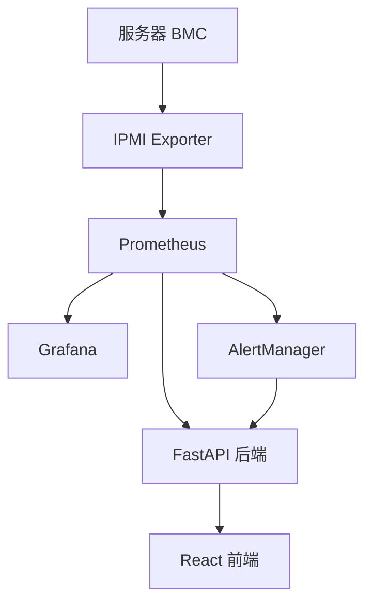

# 监控系统管理员手册

## 1. 系统架构概述

### 1.1 组件架构
OpenServerHub 监控系统采用微服务架构，包含以下核心组件：

1. **IPMI Exporter**: 独立容器运行，负责从服务器 BMC 采集硬件传感器数据
2. **Prometheus**: 时序数据库，负责数据存储、查询和告警规则评估
3. **AlertManager**: 告警处理中心，负责告警分组、去重和通知发送
4. **Grafana**: 数据可视化平台，提供丰富的仪表板和图表展示
5. **FastAPI 后端**: 应用集成层，提供监控数据查询 API 和配置管理
6. **React 前端**: 用户界面层，集成监控功能到主应用中

### 1.2 数据流向


## 2. 部署管理

### 2.1 系统要求

#### 2.1.1 硬件要求
- **CPU**: 4核以上
- **内存**: 8GB以上
- **磁盘**: 50GB以上可用空间（用于监控数据存储）
- **网络**: 千兆以太网

#### 2.1.2 软件要求
- Docker 20.10+
- Docker Compose 1.29+
- Linux/Windows/macOS 操作系统

### 2.2 部署步骤

#### 2.2.1 启动监控系统
```bash
# 进入项目根目录
cd OpenServerHub

# 启动监控系统组件
docker-compose -f docker/docker-compose.monitoring.yml up -d

# 查看运行状态
docker-compose -f docker/docker-compose.monitoring.yml ps
```

#### 2.2.2 验证部署
1. Prometheus: http://localhost:9090
2. AlertManager: http://localhost:9093
3. Grafana: http://localhost:3001

### 2.3 配置管理

#### 2.3.1 Prometheus 配置
配置文件位置: `monitoring/prometheus/prometheus.yml`

关键配置项:
```yaml
global:
  scrape_interval: 30s     # 数据抓取间隔
  evaluation_interval: 30s # 告警评估间隔

scrape_configs:
  - job_name: 'ipmi-servers'
    scrape_interval: 1m
    metrics_path: /ipmi
    file_sd_configs:       # 文件服务发现
      - files:
        - /etc/prometheus/targets/ipmi-targets.json
    relabel_configs:
    - source_labels: [module]
      target_label: __param_module
    - source_labels: [__param_target]
      target_label: instance
    - target_label: __address__
      replacement: ipmi-exporter:9290
```

#### 2.3.2 AlertManager 配置
配置文件位置: `monitoring/alertmanager/alertmanager.yml`

关键配置项:
```yaml
global:
  smtp_smarthost: 'smtp.gmail.com:587'  # SMTP服务器
  smtp_from: 'alerts@openshub.com'      # 发件人

route:
  group_by: ['alertname', 'cluster']    # 告警分组
  receiver: 'default'                   # 默认接收器

receivers:
  - name: 'default'
    email_configs:
      - to: 'admin@openshub.com'        # 收件人
```

#### 2.3.3 Grafana 配置
数据源配置: `monitoring/grafana/provisioning/datasources/prometheus.yml`

```yaml
apiVersion: 1
datasources:
  - name: Prometheus
    type: prometheus
    access: proxy
    url: http://prometheus:9090
    isDefault: true
    editable: false
```

## 3. 监控配置管理

### 3.1 动态目标配置

#### 3.1.1 目标配置文件
位置: `monitoring/prometheus/targets/ipmi-targets.json`

格式:
```json
[
  {
    "targets": ["ipmi-exporter:9290"],
    "labels": {
      "server_id": "1",
      "server_name": "server-01",
      "module": "remote",
      "ipmi_ip": "192.168.1.100",
      "manufacturer": "Dell",
      "__param_target": "192.168.1.100"
    }
  }
]
```

#### 3.1.2 自动配置同步
当在 OpenServerHub 中添加或删除服务器时，系统会自动:
1. 更新目标配置文件
2. 通知 Prometheus 重新加载配置
3. 为新服务器创建 Grafana 仪表板
4. 在IPMI设备上创建openshub用户用于监控

### 3.2 IPMI Exporter 管理

#### 3.2.1 单个 Exporter 部署
```bash
docker run -d \
  --name ipmi-exporter-1 \
  -p 9290:9290 \
  -v /path/to/ipmi_local.yml:/config/ipmi_local.yml \
  prometheuscommunity/ipmi-exporter:v1.10.1 \
  --config.file=/config/ipmi_local.yml
```

#### 3.2.2 批量 Exporter 部署
使用 `docker-compose.ipmi.yml` 模板化部署多个 Exporter。

### 3.3 告警规则管理

#### 3.3.1 告警规则文件
位置: `monitoring/prometheus/rules/hardware_alerts.yml`

示例规则:
```yaml
groups:
  - name: server_hardware
    interval: 30s
    rules:
      # CPU温度告警
      - alert: HighCPUTemperature
        expr: ipmi_temperature_celsius{name=~".*CPU.*"} > 80
        for: 2m
        labels:
          severity: warning
          component: cpu
        annotations:
          summary: "CPU温度过高"
          description: "服务器 {{ $labels.server_name }} CPU温度达到 {{ $value }}°C"

      # 风扇故障告警
      - alert: FanFailure
        expr: ipmi_fan_speed_rpm == 0
        for: 30s
        labels:
          severity: critical
          component: fan
        annotations:
          summary: "风扇故障"
          description: "服务器 {{ $labels.server_name }} 风扇停止转动"

      # 服务器离线告警
      - alert: ServerDown
        expr: up{job="ipmi-servers"} == 0
        for: 5m
        labels:
          severity: critical
          component: connectivity
        annotations:
          summary: "服务器离线"
          description: "服务器 {{ $labels.server_name }} 无法连接"
          
      # 电压异常告警
      - alert: VoltageAnomaly
        expr: abs(ipmi_voltage_volts - 3.3) > 0.3
        for: 1m
        labels:
          severity: warning
          component: voltage
        annotations:
          summary: "电压异常"
          description: "服务器 {{ $labels.server_name }} 电压 {{ $labels.name }} 达到 {{ $value }}V"
```

#### 3.3.2 添加自定义规则
1. 编辑告警规则文件
2. 添加新的告警规则
3. 重启 Prometheus 或发送重新加载信号

## 4. 系统维护

### 4.1 日志管理

#### 4.1.1 查看组件日志
```bash
# 查看 Prometheus 日志
docker logs prometheus

# 查看 AlertManager 日志
docker logs alertmanager

# 查看 Grafana 日志
docker logs grafana

# 查看 IPMI Exporter 日志
docker logs ipmi-exporter
```

#### 4.1.2 日志级别配置
在各组件的配置文件中设置日志级别以控制日志输出量。

### 4.2 数据备份

#### 4.2.1 Prometheus 数据备份
```bash
# 备份 Prometheus 数据
docker run --rm \
  -v prometheus_data:/prometheus \
  -v /backup/path:/backup \
  busybox tar czf /backup/prometheus_backup.tar.gz -C /prometheus .
```

#### 4.2.2 Grafana 配置备份
```bash
# 备份 Grafana 数据
docker run --rm \
  -v grafana_data:/var/lib/grafana \
  -v /backup/path:/backup \
  busybox tar czf /backup/grafana_backup.tar.gz -C /var/lib/grafana .
```

### 4.3 性能监控

#### 4.3.1 资源使用监控
监控各组件的 CPU、内存、磁盘使用情况:
- Prometheus: 4核CPU, 8GB内存
- AlertManager: 2核CPU, 2GB内存
- Grafana: 2核CPU, 4GB内存
- IPMI Exporter: 0.5核CPU, 128MB内存

#### 4.3.2 查询性能优化
1. 避免使用过于复杂的查询表达式
2. 合理设置抓取间隔
3. 使用指标标签进行数据分片

### 4.4 系统升级

#### 4.4.1 组件升级
```bash
# 拉取最新镜像
docker-compose -f docker/docker-compose.monitoring.yml pull

# 重启服务
docker-compose -f docker/docker-compose.monitoring.yml up -d
```

#### 4.4.2 配置升级
在升级前检查新版本的配置文件格式是否有变化，并相应更新配置文件。

## 5. 故障排除

### 5.1 常见问题诊断

#### 5.1.1 Prometheus 无法抓取数据
检查步骤:
1. 确认 IPMI Exporter 是否正常运行
2. 检查网络连接是否正常
3. 验证目标配置文件是否正确
4. 查看 Prometheus 日志获取错误信息
5. 检查服务器是否启用了监控功能

#### 5.1.2 告警未触发
检查步骤:
1. 验证告警规则表达式是否正确
2. 检查指标数据是否符合告警条件
3. 查看 AlertManager 配置是否正确
4. 检查通知渠道配置

#### 5.1.3 Grafana 无法显示数据
检查步骤:
1. 验证数据源配置是否正确
2. 检查 Prometheus 是否有数据
3. 验证查询语句是否正确
4. 查看 Grafana 日志获取错误信息

### 5.2 性能问题处理

#### 5.2.1 高 CPU 使用率
可能原因:
1. 查询过于复杂
2. 抓取间隔设置过短
3. 告警规则过多

解决方案:
1. 优化查询表达式
2. 调整抓取间隔
3. 简化告警规则

#### 5.2.2 高内存使用率
可能原因:
1. 数据保留时间过长
2. 时间序列过多
3. 查询结果集过大

解决方案:
1. 调整数据保留策略
2. 优化指标标签
3. 限制查询时间范围

## 6. 安全管理

### 6.1 访问控制

#### 6.1.1 网络安全
1. 限制监控组件的网络访问
2. 使用内部网络进行组件间通信
3. 配置防火墙规则保护暴露的端口

#### 6.1.2 认证授权
1. 修改默认密码
2. 使用强密码策略
3. 定期更新认证信息

### 6.2 数据安全

#### 6.2.1 敏感信息保护
1. 加密存储敏感信息
2. 使用环境变量传递密码
3. 定期轮换认证凭据

#### 6.2.2 通信安全
1. 使用 HTTPS 加密通信
2. 验证证书有效性
3. 定期更新 TLS 证书

## 7. 监控指标

### 7.1 系统指标
- 各组件 CPU、内存、磁盘使用率
- 网络连接状态和流量
- 容器运行状态

### 7.2 业务指标
- 监控数据采集成功率
- 告警触发和处理情况
- 用户查询响应时间

## 8. 扩展配置

### 8.1 集成其他 Exporter
可以集成其他 Prometheus Exporter 来扩展监控能力：
- Node Exporter: 操作系统和硬件监控
- SNMP Exporter: 网络设备监控
- Blackbox Exporter: 网络探测监控

### 8.2 自定义仪表板
Grafana 支持创建自定义仪表板：
1. 使用 Grafana 的可视化组件
2. 创建自定义查询和计算
3. 设置仪表板权限和分享

## 9. 监控策略

### 9.1 数据保留策略
- Prometheus 默认保留 90 天数据
- 可通过 `--storage.tsdb.retention.time` 参数调整
- 定期清理过期数据以节省存储空间

### 9.2 告警策略
- 根据业务重要性设置不同的告警级别
- 避免告警风暴，合理设置告警分组
- 定期审查和优化告警规则

## 10. 最佳实践

### 10.1 部署最佳实践
1. 使用容器化部署提高可维护性
2. 配置资源限制避免资源争用
3. 实施备份策略保护重要数据

### 10.2 运维最佳实践
1. 定期监控系统健康状态
2. 建立故障响应流程
3. 定期进行性能调优

### 10.3 安全最佳实践
1. 实施最小权限原则
2. 定期更新系统和组件
3. 监控安全事件和异常行为

## 11. 附录

### 11.1 端口映射表
| 组件 | 容器端口 | 主机端口 | 用途 |
|------|----------|----------|------|
| Prometheus | 9090 | 9090 | 监控数据存储和查询 |
| AlertManager | 9093 | 9093 | 告警处理 |
| Grafana | 3000 | 3001 | 数据可视化 |
| IPMI Exporter | 9290 | 9290 | IPMI数据采集 |

### 11.2 常用命令
```bash
# 启动监控系统
docker-compose -f docker/docker-compose.monitoring.yml up -d

# 停止监控系统
docker-compose -f docker/docker-compose.monitoring.yml down

# 查看运行状态
docker-compose -f docker/docker-compose.monitoring.yml ps

# 查看日志
docker-compose -f docker/docker-compose.monitoring.yml logs -f

# 更新配置
docker-compose -f docker/docker-compose.monitoring.yml exec prometheus kill -HUP 1
```

### 11.3 配置文件位置
```
monitoring/
├── prometheus/
│   ├── prometheus.yml          # 主配置文件
│   ├── rules/                  # 告警规则
│   │   └── hardware_alerts.yml
│   └── targets/                # 动态目标配置
│       └── ipmi-targets.json
├── alertmanager/
│   └── alertmanager.yml        # 告警管理器配置
├── grafana/
│   └── provisioning/           # Grafana 配置
│       ├── datasources/
│       └── dashboards/
└── ipmi-exporter/
    └── ipmi_local.yml          # IPMI Exporter 配置
```